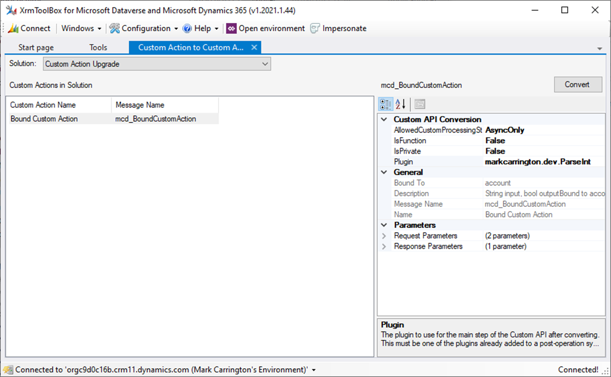
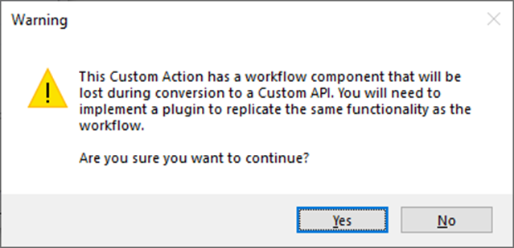
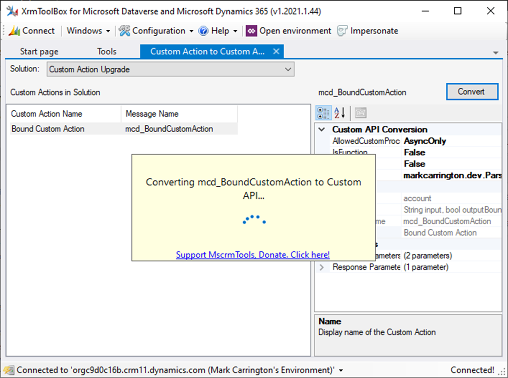
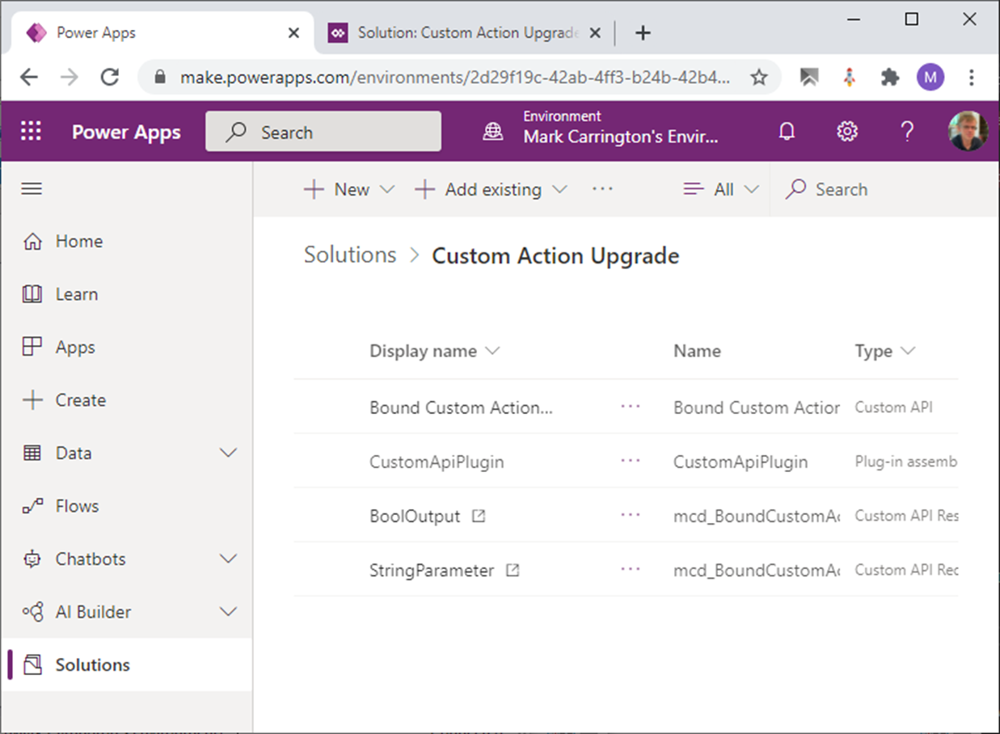

# Custom Action to Custom API Converter

This tool for [XrmToolBox](https://www.xrmtoolbox.com) automates the process of converting Custom Actions to the newer Custom API framework.

## User Guide

The tool works with solutions. First select the (unmanaged) solution that contains your Custom Actions, and all the available Custom Actions will be listed underneath.
Select one of the custom actions to see the details of how it will be converted on the right hand side

The "General" section on the right shows information about the Custom Action, and the "Parameters" section shows the input and output parameters that will be converted.

The "Custom API Conversion" section at the top adds extra information about the Custom API that will be created. Some of these details will have default values suggested
based on the Custom Action that is being converted, but please review them and ensure they are correct as some of them cannot be changed later.

* **AllowedCustomProcessingStepType** - this defines the type of steps that other plugins can be attached to on this API. The value of this will be determined by the steps
  that are already registered for the Custom Action, but you may want to make this more lenient to allow other types of steps as well in the future. All plugin steps already
  registered will be preserved during the conversion, so you won't be able to make this more restrictive. For example, if you have a plugin registered for an async step you
  will be able to select either `AsyncOnly` or `SyncAndAsync` but not `None`.
* **IsFunction** - indicates if the Custom API should be treated as a function rather than an action when called from the Web API. A function is called with a `GET` request
  rather than the `POST` request used for actions, and functions must have at least one response parameter. This option always defaults to `false`, and cannot be modified
  once the Custom API has been created.
* **IsPrivate** - hides the Custom API from metadata to discourage its use by third parties. This option always defaults to `false`
* **Plugin** - the plugin to use to implement the main operation of the Custom API. A common pattern for Custom Actions is to have no workflow defined for the body of the
  action, but to register a plugin in a synchronous post-operation step. This property will be automatically set to the first such plugin that is registered on the Custom
  Action

Once you have reviewed and adjusted these settings as appropriate, click the "Convert" button in the top right.

If the Custom Action has a body defined in the workflow editor, you will see a warning indicating that this will be lost during the conversion and that you will need to
re-implement the same logic in a plugin. Check that you have either already done this or have a copy of what this workflow step did in order to recreate the same logic in
a workflow before proceeding:

If you click "Yes" to continue, or the Custom Action does not have a workflow-defined body, the conversion will then begin:

Once the Custom Action has been converted to a Custom API, the list of available Custom Actions will refresh and you will see that the previous one is no longer there. If your
solution contains multiple Custom Actions you can now repeat the process on the remaining ones.

## Important notes

This tool should be run in your development environment where your solutions are unmanaged. You will then be able to export a new managed version of your solution with your
new Custom API and import it into your production environments to replace the previous Custom Action.

During the conversion, the Custom Action is deleted and then recreated as a Custom API. In order to delete the Custom Action, any plugin steps registered for that message must
also be deleted. The tool takes care to recreate these steps on the new Custom API, as well as add them to the same solution(s) as the original steps.

The deletion of the Custom Action and the creation of the Custom API is done in a single transaction, so if any part of the process fails it is all rolled back and none of your
configuration is lost. However, the original plugin steps are not recreated until after this process is complete. It is possible that the Custom Action is deleted, the Custom
API is created but some other problem occurs while re-adding the plugin steps. If this happens you will need to add the steps again manually.

If different environments have additional plugin steps registered on the original Custom Action message, you may enounter errors when importing the new solution with the
Custom API. You will need to remove these additional steps before importing the new solution and recreate them manually afterwards.